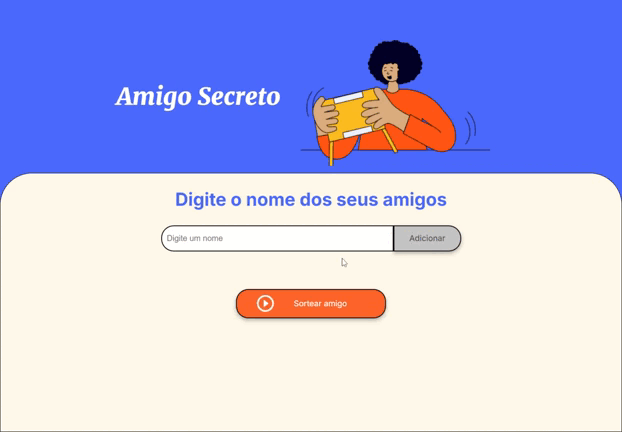

# challenge-amigo-secreto
primeiro desafio programa ONE - conceitos fundamentais de lógica de programação

Com este desafio, foi colocado em prática conceitos fundamentais de lógica de programação, como variáveis, condicionais, funções, listas e loops de repetição.
